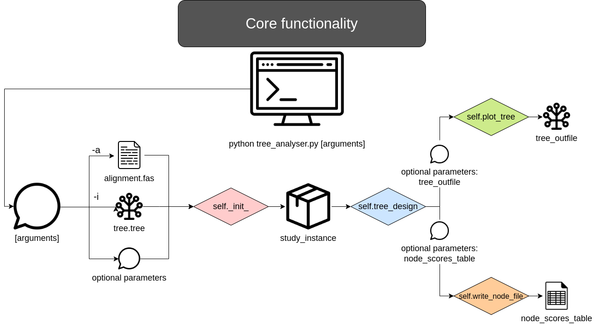

# Folder containing the main algorithm to be called by the user, as well as a src folder where all functionalities are developed.



## tree_analyzer.py
Main algorithm to be called by the user. Depending on which out files he inputs as outfiles, the script will execute different modules, or all of them.
```
python tree_analyzer -h
usage: tree_analyzer.py [-h] -i TREE_INFILE 
                             -a ALIGNMENT_INFILE 
                             -t TABLE_INFILE 
                             -u UNIPROT_INFILE 
                             [-o TREE_OUTFILE]
                             [-n NODE_SCORE_TABLE]
                             [-c {simple,all_vs_all, 
                                  whole_annotation_simple,
                                  whole_annotation_all_vs_all,
                                  all_vs_all_means,
                                  whole_annotation_all_vs_all_means}]
                             [-g {Y,N}] 
                             [-e MIN_EVALUE] 
                             [-f ANNOTATION_FEATURE]
                             [-m TREE_HEIGHT] 
                             [-w TREE_WIDTH] 
                             [-x {px,mm,in}]
                             [-p PLOT_THRESHOLD]

Handles the desired output information by the user and asks for the required
input files.

optional arguments:
  -h, --help            show this help message and exit

INFILES:
  Files of input data for our script to process.

  -i TREE_INFILE, --tree_infile TREE_INFILE
                        Tree file in Newick format.
  -a ALIGNMENT_INFILE, --alignment_infile ALIGNMENT_INFILE
                        Alignment corresponding to the tree file, with the
                        tree leaf names as headers.
  -t TABLE_INFILE, --table_infile TABLE_INFILE
                        Table file with the required format.
  -u UNIPROT_INFILE, --uniprot_infile UNIPROT_INFILE
                        File containing the uniprot annotations for our data
                        cluster.

OUTFILES:
  Files where our script will write the output.

  -o TREE_OUTFILE, --tree_outfile TREE_OUTFILE
                        File where we will save the image of our phylogenetic
                        tree with the secuence in the specified annotation and
                        the node scores.
  -n NODE_SCORE_TABLE, --node_score_table NODE_SCORE_TABLE
                        File where we will store the node scores for our tree.

SCRIPT PARAMETERS:
  Different parameters which will modify how the script works.

  -c {simple,all_vs_all,whole_annotation_simple,whole_annotation_all_vs_all,all_vs_all_means,whole_annotation_all_vs_all_means}, --calculus_algorithm {simple,all_vs_all,whole_annotation_simple,whole_annotation_all_vs_all,all_vs_all_means,whole_annotation_all_vs_all_means}
                        Select which calculation algorithm you want to utilize
                        to calculate the node scores in your tree.
  -g {Y,N}, --differentiate_gap_positions {Y,N}
                        Decide if you want your calculus algorithm to
                        differentiate gaps from aminoacids. Algorithms that
                        accept this parameter = 'Y': 'simple', 'all_vs_all',
                        'all_vs_all_means'.
  -e MIN_EVALUE, --min_evalue MIN_EVALUE
                        Minimum evalue to take into account an uniprot hit.
  -f ANNOTATION_FEATURE, --annotation_feature ANNOTATION_FEATURE
                        Feature for which we want to represent our tree or get
                        the node scores.
  -m TREE_HEIGHT, --tree_height TREE_HEIGHT
                        Height of our tree image output.
  -w TREE_WIDTH, --tree_width TREE_WIDTH
                        Width of our tree image output.
  -x {px,mm,in}, --tree_size_units {px,mm,in}
                        Units in which we measure our tree image size.
  -p PLOT_THRESHOLD, --plot_threshold PLOT_THRESHOLD
                        Minimum value of a node score in order to plot it in
                        our tree image.
```

## src
Folder containing all the different modules that call each other in order to make tree_analyzer.py work.
